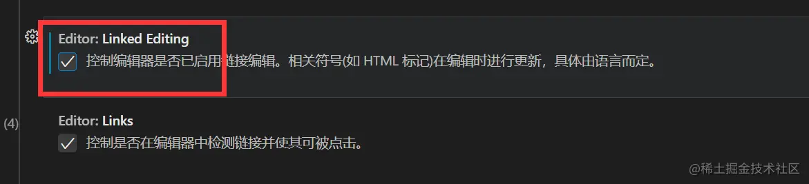
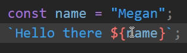
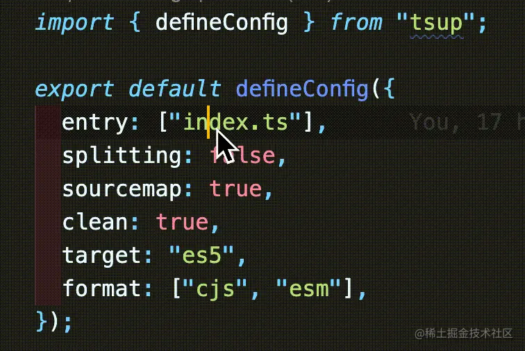
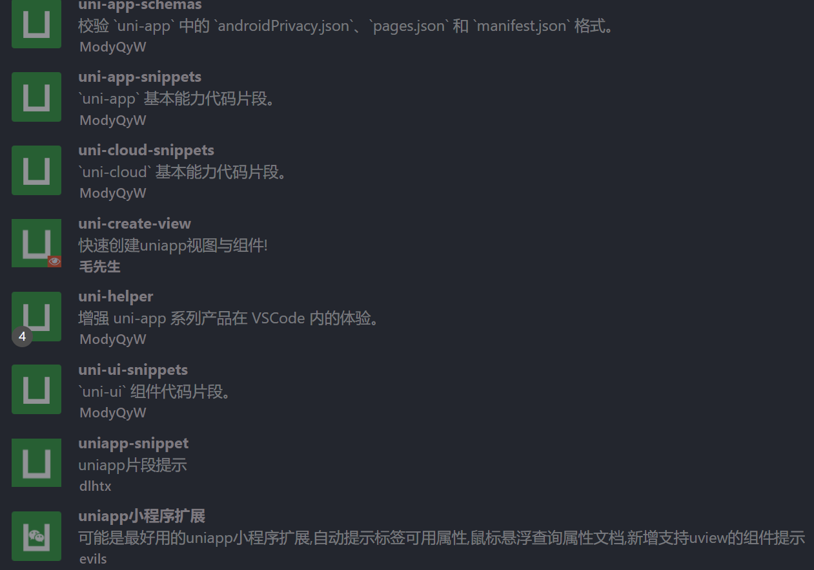

# Vscode-Plug-In 全网最全 -weiShaoY
##转载请附上作者GitHub仓库链接

## 林檎的旅行笔记

` 代码补全`

## 别名路径跳转
` 路径跳转`


``` js
路径映射
例如{'@':'/Src','components':'/src/components'}，/表示项目根目录
```
``` js
Jsconfig.json
   {
  "Compileroptions": {
    "Experimentaldecorators": True,
    "Baseurl": "./",
    "Paths": {
      "@/*": ["Src/*"],
      "Components/*": ["Src/components/*"],
      "Assets/*": ["Src/assets/*"],
      "Views/*": ["Src/views/*"],
      "Common/*": ["Src/common/*"],
    }
  },
  "Exclude": ["Node_modules", "Dist"]
}
```


##
` `

```

```

## 掘金
` 摸鱼`

```js
快捷键
      沸点  Ctrl + J + J
      文章  Ctrl + P + P
```
## 小程序开发助手
`小程序`


## A-super-comprehensive
` 代码片段`

## Auto Close Tag
` Html`

```
自动关闭标签
当我们输入 <Div/ 时，它会自动把后面的括号补充好
```
## Auto Rename Tag
`Html `

```
自动完成另一侧标签的同步修改
```

 Vscode内置方案    

​								点击设置，搜索Link，把这个勾选上，就可以左右重命名标签了

​								在Html中是支持的，而vue中则是要安装volar，vetur是不行的。volar可以配置vue2的。并且jsx也是不支持的，图方便的话，还是保留着吧。

## Bco-translate
` 翻译`

```
一款快速生成英文变量名的插件,支持驼峰,需配置百度翻译
```
## Better Comments
` 注释`

代码注释设置成不同颜色

```
///
//!
//?
////
//Todo
//*
```
## Bookmarks
` 提示`

```
书签
```
## Chinese (Simplified)
`官方简体中文包 `

## ClassTree
` Css`

Class Tree 基于 Ast 分析提取Class 快速提取Class 输出对应结构

解决在前端主流Vue，react框架开发中定义初始 Dom Class 命名后仍需要去编写 Scss/less 样式结构，该插件可自动快速生成定义好Class 树状结构增快业务开发速度原理

```js
快捷键
      Windows：ctrl+1 （React） | Ctrl+2 （Vue）
      Mac:     Cmd+1  （react） | Cmd+2（vue）
```
## Code Runner
`调试 `

支持用多种语言立即执行代码 Alt + Q
```
键盘快捷键 Ctrl+alt+n
快捷键 F1 调出 命令面板, 然后输入 Run Code
在编辑区，右键选择 Run Code
在左侧的文件管理器，右键选择 Run Code
右上角的运行小三角按钮
一键执行各种语言代码（常用于测试）
```

## Code Translate
` 翻译`

```
一款纯粹的 Vscode 滑词翻译插件
```
## Color Highlight
`颜色 `

扩展样式可以在您的文档中找到 Css/web 颜色


## css-class-intellisense
` 提示` ` Html`

目前只支持Html文件

实时监测 Html 文件，对引入的 Css 文件进行智能提示，包括本地和远程文件。并对内嵌的 Css 提示 Html 标签内的 Class


## Debug Visualizer
` 调试`

用于在调试时可视化数据结构的 Vs Code 扩展

与 Vs Code 的观察视图类似，但具有丰富的观察值可视化

## Dot Env
` 调试`

不管是前端项目还是后端项目，大多都会使用 .Env 文件来保存环境变量

这款插件可以对 .Env 文件进行高亮
## Easy LESS
`Css `
.Css每次保存文件时生成一个.less文件。例如styles.less-->styles.css

创建一个.Less文件

按 Ctrl/cmd+s 保存文件

.Css会自动生成一个文件

您应该会在状态栏中看到一条临时的“Less Compiled In X Ms”消息
``` js
Settings.json
"Less.compile": {
    //Less插件配置生成文件保存位置
    "Out": "../Css/"
  },
```
## Element UI Snippets
`代码片段 ` `Ui `

Element Ui 的代码片段


## Element-ui-helper
` 代码片段`

鼠标放到Element组件标签上面,提示相应的组件属性和方法


## Emoji
`注释 `

彩色表情
```
打开命令面板Command/ctrl + P 类型>选择Emoji: Insert Emoji
通过点击并选择要在光标处插入的表情符号来运行Emoji: Insert Emoji或emoji: Insert Emoji Unicode在命令面板中。enter
```

## Error Lens
` 规则`

Errorlens 通过使诊断更加突出来增强语言诊断功能，在语言生成诊断的任何地方突出显示整行，并内联打印消息


## ES7+ React/Redux/React-Native snippets
`代码片段 `

Es7+ 中的 Javascript 和 React/redux 片段

```
可以快速创建模板代码，提高我们的开发效率。
比如使用 React 的 Usestate Hook，它可以自动转换 Setxxx 的驼峰命名法，以及自动跳转光标位置
```

## ESLint
`规则 ` `提示 `

文档  <Https://eslint.org/docs/latest/>


## ESLint Chinese Rules
` 提示` ` 代码片段`  ` 注释`

Github Copilot 使用 Openai Codex 从您的编辑器中实时建议代码和整个功能


## GitHub Pull Requests and Issues
`Git `

此扩展允许您在 Visual Studio Code 中查看和管理 Github 拉取请求和问题

```
验证 Vs Code 并将其连接到 Github。github Enterprise 受社区支持，请参阅此Pr了解如何设置。
从 Vs Code 中列出和浏览 Pr。
在 Vs Code 中使用编辑器内评论来审查 Pr。
从 Vs Code 中通过简单的检出验证 Pr。
使 Ui 和 Cli 共存的终端集成。
从 Vs Code 中列出和浏览问题。
“@”提到的用户和问题的悬停卡。
对用户和问题的完成建议。
可以为您创建分支的“开始处理问题”操作。
从“待办事项”注释中创建问题的代码操作。
```
## Htmltagwrap
` Html`

快速包裹Dom标签

我们可以选择一段 Dom 标签，然后按住 Options+w / Alt+w，就可以在外层创建一个标签了。

```js
快捷键
      Windows：Options+w
      Mac:     Alt+w
```
```
冲突
      和翻译插件 Wisen Translate 自带快捷键冲突
      解决方法: 把Wisen Translate 快捷方式删除
```
## Image preview

` 图片`

在装订线和悬停时显示图像预览

当引入路径为图片时，可以预览当前图片

## Javascript console utils
` 注释`

将Console.log 改为彩色


## Live Server
` 调试`

为静态和动态页面启动具有实时重新加载功能的本地开发服务器

## Markdown All in One
`Markdown `

Markdown 所需的一切（键盘快捷键、目录、自动预览等
## Markdown Preview VS Code Highlighting
` Markdown`

Markdown 预览 Vs 代码高亮

在 Vs Code 的内置 Markdown 预览中使用Shiki进行代码高亮

使得预览的颜色更好地匹配您在 Vs Code 文本编辑器中看到的颜色


## Node-snippets
` 代码片段`

为您提供一些很棒的 Nodejs 片段


## Npm Intellisense
`Npm `

在 Import 语句中自动完成 Npm 模块的 Visual Studio Code 插件

可以帮助我们智能感知要导入的模块


## Npm-import-package-version
` Npm`

在代码中显示 Npm 包版本的扩展


## open in browser
`调试 `

在浏览器打开当前文件

```js
快捷键
      在默认浏览器中打开  Alt + B
      在指定浏览器中打开  Shift + Alt + B
```
## Package.json Helper
` 提示`

一个 Package.json 依赖助手，快速转到定义并在悬停时显示详细信息

聚焦时显示工具提示

聚焦时显示版本和描述行尾

```js
Cmd/ctr + 左键单击转到 Node_module/{pageckage_name}/package.json
```

## Parameter Hints
` 提示`

参数提示

``` js
设置
      Parameterhints.enabled         启用参数提示
      Parameterhints.hintingtype     启用参数提示类型
      Parameterhints.languages       仅为所选语言启用参数提示
      Parameterhints.padding         填充
提示   Parameterhints.toggle          隐藏/显示提示

自定义背景和前景色
设置       Settings.json
{
    "Workbench.colorcustomizations": {
        "Parameterhints.hintbackground": "#37415180",
        "Parameterhints.hintforeground": "#9ca3af"
    }
}
```
## Path Autocomplete
`提示 `

为 vscode 代码提供路径补全


## Path-alias
`提示 `

可以解决路径别名提示，跳转的Vscode插件
``` js
设置       Settings.json
 "Pathalias.aliasmap": {
    // Key是你要定义的别名 | 使用${Cwd}来代替当前工作目录的绝对路径
    "@": "${Cwd}/src"
  },
  配合 别名路径跳转插件使用
```

##    Postcode
` 调试`

可用于创建和测试简单和复杂的 Http/s 请求，以及查看响应

## Prettier
` 规则`


## Px to rem & rpx & vw (cssrem)
` 调试`

在 Vscode 中转换Px和rem单位，并支持 Wxss


##    Quokka.js
` 调试`

实时显示代码的运行结果

直接显示变量结果


## Sass
`Css ` `规则 `

Vscode 的缩进 Sass 语法高亮、自动完成和格式化程序


## SCSS IntelliSense
`Css ` `提示 `

提示你项目中Scss文件中定义的变量

## SVG
`图片 `

强大的 Svg 语言支持扩展。处理 Svg 所需的几乎所有功能

## Template String Converter
` Html` ` 提示`



``` js
在字符串中输入$触发，将字符串转换为模板字符串
单 ( '')、双 ( "") 或两者

在嵌套引号的情况下，将最外面的引号转换为反引号

当 $ Or  {被删除时，用引号替换反引号

在模板字符串中，在${键入时将字符串转换为模板字符串

为 Jsx 属性的模板字符串添加括号

```

## Toggle Quotes
`Js `



Avascript 的字符串可以支持三种形式，单引号、双引号、尖角号，有时候我们想要拼接字符串时，需要将原来的单引号或双引号改为尖角号。使用这个插件，只需要按下快捷键 Ctrl+'就可以做到
```js
快捷键
      Win  Ctrl + '  (Ctrl  回车键左边第一颗)
      Mac  Cmd  + '
```

## Trailing Spaces
` Js`

显示尾部空格


## Vite
` 调试`

```js
V3 打开项目后立即启动开发服务器
无需离开编辑器即可预览/调试您的应用
Npm I Yarn Pnpm I⬢打开新项目时提示快速安装节点模块 ( )
一键构建和服务
一键重启服务器
```


## Vue 3 Snippets
`代码片段 `

Vue 3 代码段


## Vue Language Features (Volar)
` 调试`

需要禁用 Vetur 以避免冲突
为 Vue、vitepress 和 Petite-vue 构建的语言支持扩展
Volar 不包含 Eslint 和 Prettier，但是官方的eslint和prettier扩展支持 Vue
## Vue VSCode Snippets
`代码片段 `

Vue Vscode 代码段


## Vue-component
` 提示`

Template中输入组件名称自动提示找到的组件（详见设置说明），选中后自动输入组件名（包含必填属性）、import语句、components属性（如果有需要）


## Vue-helper
` 代码片段`

增强了编写 Vue 的能力和 Element-ui、vux、iview 的扩展


## Wisen-Translate
` 翻译`

鼠标悬浮翻译
```js
冲突
	和Html插件  Htmltagwrap 自带快捷键冲突 解决方法,把Wisen Translate 快捷方式删除
```


## WXML - Language Service


` 代码片段`

```js
提示
	微信小程序 .wxml 文件代码高亮，标签、属性的智能补全（同时支持原生小程序、mpvue 和 wepy 框架，并提供 code snippets）。
```


## 翻译(英汉词典)


`翻译 `

本地77万词条英汉词典，不依赖任何在线翻译API，无查询次数限制。可翻译驼峰和下划线命名，及对整个文件中的标识


## 韭菜盒子


`娱乐 `

韭菜盒子，VSCode 里也可以看股票 & 基金实时数据，做最好用的投资插件


## Any-rule


`代码片段 `

正则表达式


## Code Spell Checker


`规则 `

当我们编写代码时，偶尔会出现单词拼错的情况，这个插件可以检查到可能拼写错误的单词，并有波浪线提醒
	支持驼峰命名法


## CSS Peek


`提示 `

点击标签跳转到css代码


## GitLens — Git supercharged


`Git `

增强 VS Code 中的 Git — 通过 Git 责备注释和 CodeLens 使代码作者一目了然，无缝导航和探索 Git 存储库，通过丰富的可视化和强大的比较命令获得有价值的见解等等


## React Style Helper


`提示 ` `代码片段 `


```js
在React中更快速地编写内联样式，并对 CSS、LESS、SASS 等样式文件提供强大的辅助开发功能
		自动补全
		创建 JSX/TSX 的行内样式
		跳转至样式和变量定义位置
		预览样式及变量内容
	    行内样式自动补全，同时支持 SASS 变量的跳转及预览
```


## Vant Snippets


` 代码片段`

Vant组件库代码片段


## Vetur

` 调试`

文档  <https://vuejs.github.io/vetur/>


```js
用于 VS 代码的 Vue 工具
语义高亮
片段
错误检查
格式化
智能感知
调试
组件数据：流行的 Vue 框架和您自己的自定义组件的自动完成和悬停信息
实验插值功能：Vue 模板中的自动完成、悬停信息和类型检查
VTI：CLI 上的表面模板类型检查错误
全局组件：支持定义全局组件

```

## Vscode extension for ECharts


`代码片段 `

Echarts的代码片段
	提示各种Echar中Option 的属性，挺强大的
	安装插件后，ctrl+shift+p输入active Echars即可开启智能提示


## Vue 2 Snippet


`代码片段 `

Vue2的代码片段


## JSON to TS

`转换 `

Convert from clipboard (Shift + Ctrl + Alt + V)

```

```


## WXML - Language Service
`小程序 `

微信小程序 .wxml 文件代码高亮，标签、属性的智能补全（同时支持原生小程序、mpvue 和 wepy 框架，并提供 code snippets）


## Change-case


`js `

有时候我们想要修改变量的命名规则，比如中横线、下划线、全大写等。
这个插件可以帮助我们修改变量名。
如果只是修改一个变量名似乎挺鸡肋。但它的优势是可以同时修改很多变量名


## Theme


`主题 `

```js
Andromeda
Panda Theme
SynthWave '84
```


## Icon


`图标主题 `

``` js
Material Icon Theme
Vscode-icons
```
## Npm


`图标主题 `

``` js
Npm Intellisense
      npm模块导入智能提示

npm-import-package-version
		在引入模块的时候直接展示该模块的版本

Import Cost
		依赖包大小提示

Vant Snippets
		vant组件库提示
```
## Css


`Css `

``` js
CSS Peek
		Peek：内联加载 css 文件并在此处进行快速编辑。( Ctrl+Shift+F12)
		转到：直接跳转到 css 文件或在新编辑器中打开它 ( F12)
		悬停：悬停在符号 ( Ctrl+hover)上显示定义
		还支持符号提供程序，因此如果您已经知道类或 ID 名称，则可以快速跳转到正确的 CSS/SCSS/LESS 代码
	CSS Initial Value
		显示每个CSS属性的初始值，当光标停留在css属性时
		只支持 CSS Less Sass Scss 这种单格式文件
		不支持vue里面的style
		已卸载
	HTML CSS Support
		智能提示CSS类名以及id
			子主题 1
		据在工作区中找到的定义或通过link元素引用的外部文件为 HTML 属性提供 CSS 类名称补全。
		Vue (.vue) [需要octref.vetur
		已卸载
```

## Uni-app


`Uni-app `



``` js
Uni-create-view

支持 vue2 、vue3、composition-api(vue2)、script setup 组与页面模版使用 composition-api(vue2) 模版建议配合uni-composition-api 使用定制化强, 支持配置 css 预编辑器类型是否开启 typescript 模板, 以及是否为单文件模式创建页面, 自动查路径并添加到 pages.json -> pages 中创建分包页面, 自动查找路径添加到 pages.json -> subPackages 中支持深度目录创建, 自动查根目录下路径，写入 pages.json 后依然保留注释
```